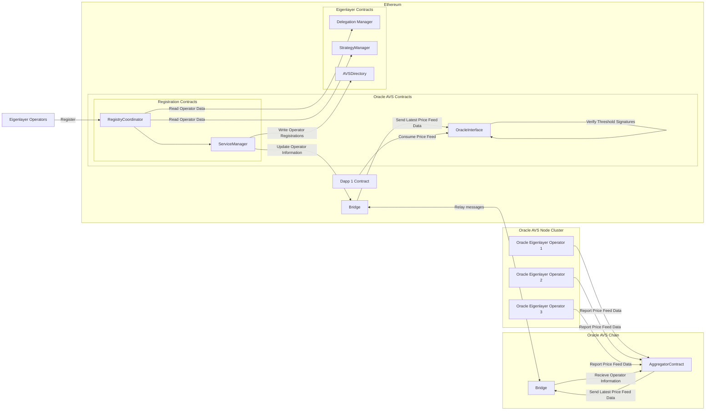

## eoracle AVS Middleware Example 
The following is an example of how eoracle leverages Eigenlayer integration with the middleware package to actively validate oracle operations. 

Eigenlayer operators are permissioned to register through the eoracle middleware , which forward information to the eoracle chain manager. Through a dedicated bridging contract, their Eigenlayer shares are forwarded to the eoracle chain, where they provide cryptographic trust and validation to oracle operations.  

[Documentation](https://eoracle.gitbook.io/eoracle/)
[eoracle middleware source code](https://github.com/Eoracle/eoracle-middleware/)

