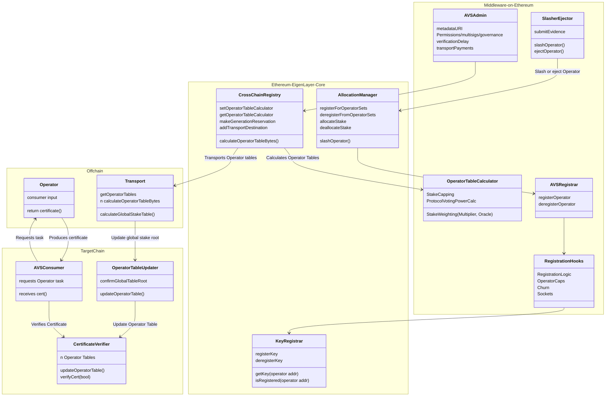

[elip-008]: https://github.com/eigenfoundation/ELIPs/blob/main/ELIPs/ELIP-008.md
[core-multichain-docs]: https://github.com/Layr-Labs/eigenlayer-contracts/tree/release-dev/multichain/docs/multichain

## MiddlewareV2

The middlewareV2 architecture simplifies AVS development by:
1. Utilizing core protocol contracts for operator key storage (`KeyRegistrar`) and task verification (`BN254CertificateVerifier` and `ECDSACertificateVerifier`)
2. Utilizing core contracts for OperatorSet (eg. quorum) membership and strategy composition in the `AllocationManager`
3. Utilizing the EigenLabs-run offchain services to update stakes instead of [`avs-sync](https://github.com/Layr-Labs/avs-sync)

---

### Contents

* [System Diagram](#system-diagram)
* [AVS Registrar](#avs-registrar)
* [Operator Table Calculator](#operator-table-calculator)
    * [`ECSDATableCalculator`](#ecdsatablecalculator)
    * [`BN254TableCalculator`](#bn254tablecalculator)
* [Core Contract Integrations](#core-contract-integrations)
    * [`KeyRegistrar`](#key-registrar)
    * [`AllocationManager`](#allocation-manager)
    * [`CertificateVerifier`](#certificate-verifier)
* [Roles and Actors](#roles-and-actors)
* [Migration](#migration)

---

### System Diagram

AVS developers only have to manage deployments of the the following contracts on-chain:
- [`AVSRegistrar`](#avs-registrar)
- [`OperatorTableCalculator`](#operator-table-calculator)
- [`Slasher`](../slashing/SlasherBase.md)
- Admin Functionality
    - Rewards Submission
    - Ejection *Note: A module for programmatic ejection will be available in a future release*. 

MiddlewareV2 architecture defines standards for the `AVSRegistrar` and `OperatorTableCalculator`. 

See the [`multichain-ELIP`](elip-008) and [`core contracts documentation`](core-multichain-docs) for more information. 

---

### AVS Registrar

The AVS Registrar is the primary interface for managing operator registration and deregistration within an AVS. It integrates with core EigenLayer contracts to ensure operators have valid keys and are properly registered in operator sets.

| File | Type | Description |
| -------- | -------- | -------- |
| [`AVSRegistrar.sol`](../../src/middlewareV2/registrar/AVSRegistrar.sol) | Proxy | Core registrar contract that handles operator registration/deregistration |
| [`AVSRegistrarWithSocket.sol`](../../src/middlewareV2/registrar/presets/AVSRegistrarWithSocket.sol) | Proxy | Adds socket URL registration for operator communication |
| [`AVSRegistrarWithAllowlist.sol`](../../src/middlewareV2/registrar/presets/AVSRegistrarWithAllowlist.sol) | Proxy | Restricts registration to allowlisted operators |
| [`AVSRegistrarAsIdentifier.sol`](../../src/middlewareV2/registrar/presets/AVSRegistrarAsIdentifier.sol) | Proxy | Serves as the AVS identifier and manages permissions |

#### Base AVSRegistrar

The `AVSRegistrar` provides base functionality for AVSs to register and deregister operators to their operatorSet. A single `AVSRegistrar` supports multiple operatorSets. ***This contract expects operator registrations and deregistrations to originate from the `AllocationManager`***.

See full documentation in [`./AVSRegistrar.md`](./AVSRegistrar.md).

---

### Operator Table Calculator

| File | Type |
| -------- | -------- |
| [`BN254TableCalculatorBase.sol`](../../src/middlewareV2/tableCalculator/BN254TableCalculatorBase.sol) | Abstract Contract |
| [`BN254TableCalculator.sol`](../../src/middlewareV2/tableCalculator/BN254TableCalculator.sol) | Basic table calculator that sums slashable stake across all strategies | 
| [`ECDSATableCalculatorBase.sol`](../../src/middlewareV2/tableCalculator/ECDSATableCalculator.sol) | Abstract Contract |
| [`ECDSATableCalculator.sol`](../../src/middlewareV2/tableCalculator/ECDSATableCalculator.sol) | Basic table calculator that sums slashable stake across all strategies | 

These contracts define custom stake weights of operators in an operatorSet. They are segmented by key-type. 

See full documentation in [`/operatorTableCalculator.md`](./OperatorTableCalculator.md).

---

### Core Contract Integrations

#### Key Registrar

#### Allocation Manager

#### Certificate Verifier

---

### Roles and Actors

---

### Migration