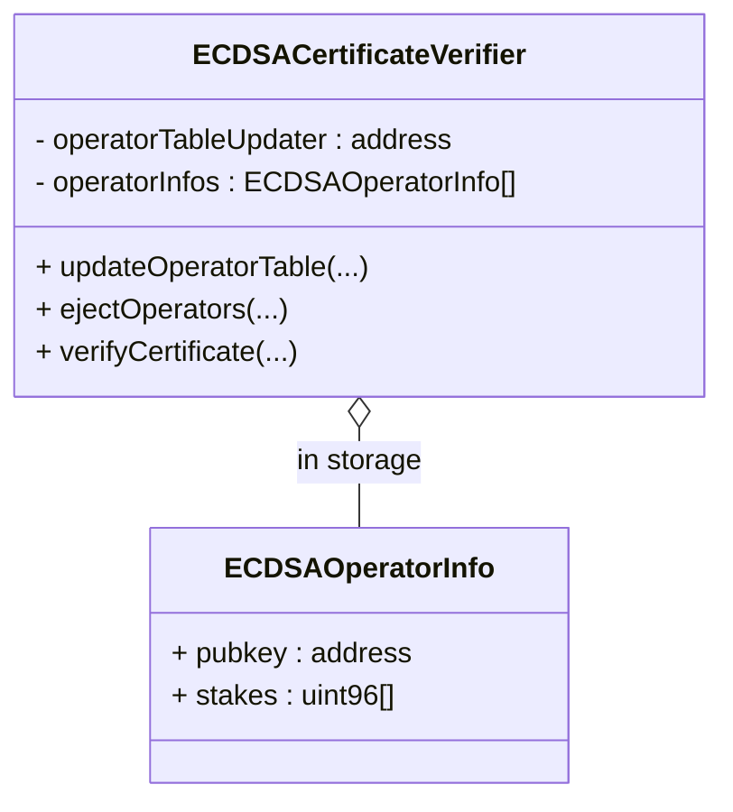

# Certificate Verification Interfaces

This document outlines the key interfaces and data structures for the certificate verification system.

## Core Data Structures

```solidity
struct OperatorSet {
    address avs;
    uint32 id;
}

struct ECDSAOperatorInfo {
	address pubkey;
	uint96[] weights;
}
```

## IECDSAOperatorTableCalculator Interface

```solidity
interface IECDSAOperatorTableCalculator {
    struct ECDSACertificate {
        ///  the timestamp identifying the operator table to verify the certificate against.
        uint32 referenceTimestamp;
        /// the hash of the message which has been signed by operators and used to verify the aggregated signature. For ex: For EigenDA it's a batch header.
        bytes32 messageHash;
        // the concatenated signature of each signing operator
        bytes sig;
    }
    
    /**
     * @notice calculates the operatorInfos for a given operatorSet
     * @param operatorSet the operatorSet to calculate the operator table for
     * @return the list of operatorInfos
     */
    function calculateOperatorTable(OperatorSet calldata operatorSet) 
        external view returns(ECDSAOperatorInfo[] memory operatorInfos);
}
```

## IECDSACertificateVerifier Interface

```solidity
interface IECDSACertificateVerifier {
    /// @notice the operatorset the CertificateVerifier is for
    function operatorSet() external returns(OperatorSet memory);
    /// @notice the address of the entity that can update the operator table
    function operatorTableUpdater() external returns(address);
    
    /**
     * @notice updates the operator table
     * @param referenceTimestamp the timestamp at which the operatorInfos were 
     * sourced
     * @param operatorInfos the new operatorInfos
     * @dev only callable by the operatorTableUpdater
     */
    function updateOperatorTable(
        uint32 referenceTimestamp, 
        ECDSAOperatorInfo[] memory operatorInfos
    ) external;
    
    /**
     * @notice ejects operators from the operatorSet
     * @param referenceTimestamp the timestamp of the operator table against 
     * which the ejection is being done
     * @param operatorIndices the indices of the operators to eject
     * @dev only callable by the operatorTableUpdater
     */
    function ejectOperators(
        uint32 referenceTimestamp,
        uint32[] operatorIndices
    ) external;

    /// @return the maximum amount of seconds that a operator table can be in the past
    function maxOperatorTableStaleness() external returns(uint32);
    
    /**
     * @notice verifies a certificate
     * @param cert a certificate
     * @return the amount of stake that signed the certificate for each stake 
     * type
     */
    function verifyCertificate(ECDSACertificate memory cert) 
        external view returns(uint96[] memory signedStakes);
        
    /**
     * @notice verifies a certificate and makes sure that the signed stakes meet 
     * provided portions of the total stake on the AVS
     * @param cert a certificate
     * @param totalStakeProportionThresholds the proportion of total stake that 
     * the signed stake of the certificate should meet
     * @return whether or not certificate is valid and meets thresholds
     */
    function verifyCertificateProportion(
        ECDSACertificate memory cert, 
        uint16[] memory totalStakeProportionThresholds
    ) external view returns(bool);
    
    /**
     * @notice verifies a certificate and makes sure that the signed stakes meet 
     * provided nominal stake thresholds
     * @param cert a certificate
     * @param totalStakeNominalThresholds the nominal amount of stake that 
     * the signed stake of the certificate should meet
     * @return whether or not certificate is valid and meets thresholds
     */
    function verifyCertificateNominal(
        ECDSACertificate memory cert, 
        uint96[] memory totalStakeNominalThresholds
    ) external view returns(bool);
}
```

## Class Diagram

